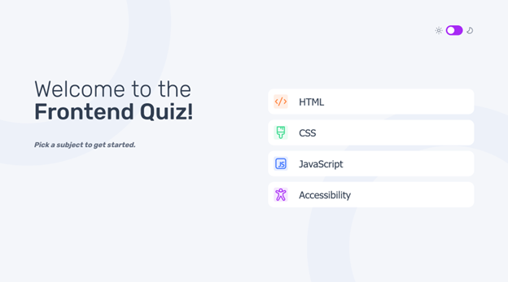
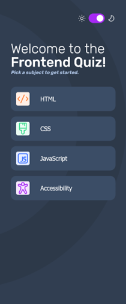

# Frontend Mentor - Frontend quiz app solution

This is a solution to the [Frontend quiz app challenge on Frontend Mentor](https://www.frontendmentor.io/challenges/frontend-quiz-app-BE7xkzXQnU). Frontend Mentor challenges help you improve your coding skills by building realistic projects. 

## Table of contents

- [Overview](#overview)
  - [The challenge](#the-challenge)
  - [Screenshot](#screenshot)
  - [Links](#links)
- [My process](#my-process)
  - [Built with](#built-with)
  - [What I learned](#what-i-learned)
  - [Continued development](#continued-development)
  - [Useful resources](#useful-resources)
- [Author](#author)
- [Acknowledgments](#acknowledgments)

**Note: Delete this note and update the table of contents based on what sections you keep.**

## Overview

### The challenge

Users should be able to:

- Select a quiz subject
- Select a single answer from each question from a choice of four
- See an error message when trying to submit an answer without making a selection
- See if they have made a correct or incorrect choice when they submit an answer
- Move on to the next question after seeing the question result
- See a completed state with the score after the final question
- Play again to choose another subject
- View the optimal layout for the interface depending on their device's screen size
- See hover and focus states for all interactive elements on the page
- Navigate the entire app only using their keyboard
- **Bonus**: Change the app's theme between light and dark

### Screenshot

### Links

- Solution URL: [https://github.com/toshirokubota/frontend-quiz](https://github.com/toshirokubota/frontend-quiz)
- Live Site URL: [https://toshirokubota.github.io/frontend-quiz/](https://toshirokubota.github.io/frontend-quiz/)

## My process

### Built with

- Semantic HTML5 markup
- CSS custom properties
- Flexbox
- Mobile-first workflow

### What I learned

- how to customize a progress bar.
- how to implement a custom switch with a checkbox.
- how to implement multiple themes.

### Continued development

Keep working on more projects.

### Useful resources

- [ Customizing a checkbox into a switch-like element ](https://www.w3schools.com/howto/howto_css_switch.asp) - This W3School page gives a CSS example for converting a checkbox input into a flip switch.
- [A concise explanation of the progress html element and how to customize it](https://www.youtube.com/watch?v=rrf99Suqmd4).

## Author

- Frontend Mentor - [@toshirokubota](https://www.frontendmentor.io/profile/toshirokubota)

## Acknowledgments

